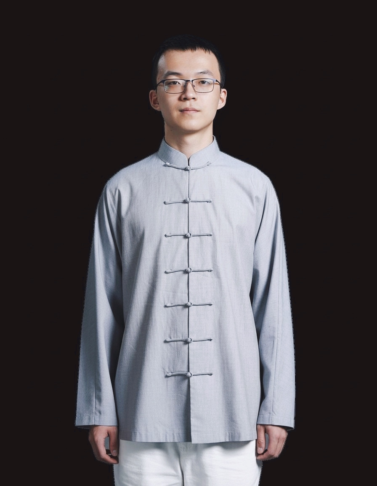

<!-- MARKDOWN CONTENT: This gets processed and inserted into {{ content }} -->
<!-- Markdown is converted to HTML, then injected into the layout -->

    

        
    

    

        <h1>Zhengxi Li</h1>
        
Undergraduate Student in Artificial Intelligence

        
MBZUAI

        
Masdar City, Abu Dhabi, United Arab Emirates

        

            <a href="zhengxi.li@mbzuai.ac.ae">Email</a>
            <a href="https://github.com/Lizhengxi25">GitHub</a>
            <a href="/cv.pdf">CV</a>
        

        

            

                I am currently an undergraduate student at MBZUAI, class of 2029. Before joining MBZUAI, I graduated from Beijing 101 High School with an International Baccalaureate Diploma Programme.

                Throughout my academic journey, I have been driven by a core philosophy: <b>correct and refine intuitions using theory and experiment</b>.
                During the past few years, I have investigated the moving mechanisms of balls and applied them to basketball training. Currently, I am particularly interested in LLM reasoning and aspire to contribute meaningful research to the field.

                At the same time, I always keep myself open to exploring a broad range of topics including, but not limited to, multi-agent systems and computer vision.
                
            

        

    

